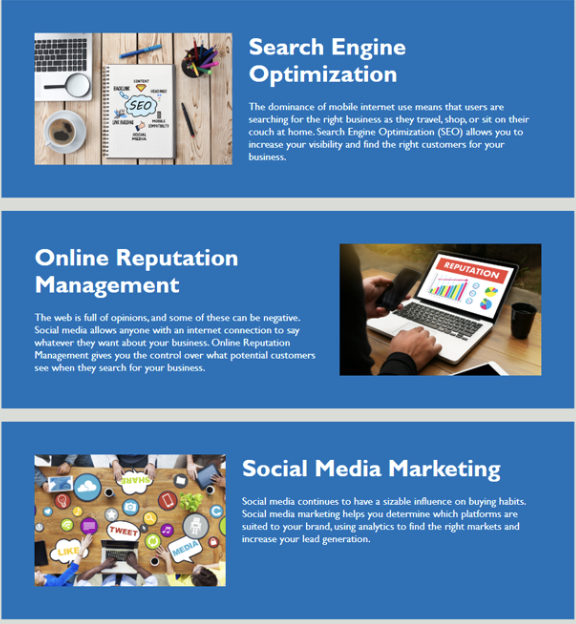

# BOOTCAMP-CHALLENGE1-PROJECT-UNO

## Description
I built this project as practical experience to test my skills after my first week of bootcamp classes. This study helped in refigning the skill set of replacing element symatic tags. I applied my knowledge from class to discover that pre codded HTML can be updated to with similar unique tags to produce the same outcome. Also, i learn that CSS files contain a numourous amount my unused could which can be condensed finding similar element traits.

## Installation
N/A

## Usage

This updated code is used to display a marketing advertisment for social media based company. What the reader will see from this webpage will help them understand the ins and outs about marketing tactics from the Horiseon campany that will increase a company's social engagement. If the reader follows the strict tags which highlight the company's efficiencies, success will likely be a guarantee. A screenshot referenced below shows some of the companies best qualities. 

## Credits
N/A

## Liscense
N/A
